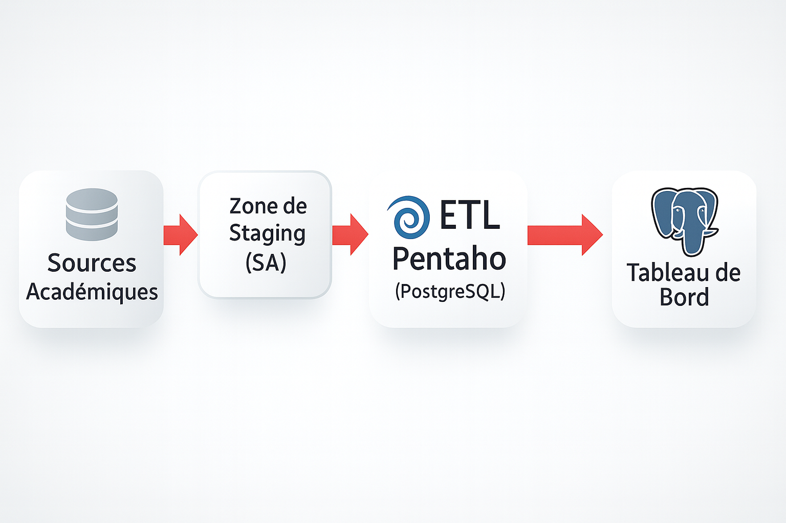

<!-- 🌐 README professionnel - Projet de Stage DSI ESPRIT (style rouge & gris) -->

<p align="center">
  
</p>


<h1 align="center" style="color:#c80000;">🎓 Stage DSI ESPRIT 2025</h1>
<h3 align="center" style="color:#555;">Entrepôt de Données Académique et Reporting Power BI</h3>

---

<p align="center">
  
  &nbsp;&nbsp;&nbsp;
  
  &nbsp;&nbsp;&nbsp;
  
  &nbsp;&nbsp;&nbsp;
  
</p>

---

## 🧠 Présentation

Ce projet est réalisé dans le cadre du **stage ingénieur à la DSI d’ESPRIT**.  
Il consiste à concevoir un **entrepôt de données académique** complet et automatisé, accompagné de **tableaux de bord Power BI** pour le suivi des indicateurs clés.

🎯 **Objectif principal :**
> Construire une infrastructure BI permettant la centralisation, la transformation et la visualisation des données académiques.

---

## 🧰 Stack Technique

| Domaine | Outil / Technologie |
|:--|:--|
| **ETL / Intégration** | Pentaho PDI (Kettle) |
| **Base de données** | PostgreSQL |
| **Visualisation / BI** | Power BI Desktop |
| **Langages** | SQL, Bash, Python |
| **Versionnement** | Git & GitHub |

---

## 🧱 Structure du dépôt

<details>
<summary><b>📂 Voir la structure complète</b></summary>

<br>

```bash
stage-dsi-esprit-2025/
│
├── 🧩 pentaho/           # Jobs & Transformations (.ktr / .kjb)
├── 🗄️ sql/               # Scripts SQL (DDL, DML, vues, seeds)
├── 📊 powerbi/           # Rapports Power BI (.pbix)
├── 📚 docs/              # Journal de bord, schémas techniques, images
│   └── images/           # Logos, architecture, workflow
├── 📁 data/              # Jeux de données anonymisés
│
├── .gitignore
├── .gitattributes
└── README.md
```

</details>

---

## 📊 Architecture du Projet

<p align="center">
  
</p>

**🧩 Description du flux :**
1. Extraction des données sources académiques vers la *Staging Area (SA)*.  
2. Nettoyage, transformation et chargement vers le *Data Warehouse (DW)*.  
3. Visualisation et analyse dans Power BI avec indicateurs dynamiques.  

---

## ⚙️ Fonctionnalités Clés

- 🔄 **Processus ETL automatisé** (de la SA vers le DW).  
- 🧹 **Nettoyage et normalisation** des données académiques (notes, modules, étudiants).  
- 🧩 **Modélisation dimensionnelle** en étoile (dimensions et faits).  
- 📈 **Tableaux de bord Power BI** interactifs pour la direction et les départements.  
- 🧾 **Documentation et journal de bord** détaillant chaque étape du flux.  

---

## 🤝 Encadrement

- 👨‍💼 **Encadrant professionnel :** Équipe DSI ESPRIT  
- 👨‍🏫 **Encadrant académique :** Département BI & Data Science  
- 👨‍💻 **Stagiaire :** *Yosra Challakhi*

---

## 🏁 Livrables

- 📦 Entrepôt de données PostgreSQL (schéma SA & DW)  
- ⚙️ Jobs Pentaho ETL complets  
- 📊 Tableau de bord Power BI interactif  
- 🗒️ Documentation technique et rapport de stage  

---

## 💡 Outils et Environnement

<p align="center">
  
  
  
  
</p>

---

## 🧾 Extrait du Workflow ETL

<p align="center">
  
</p>
*(Capture du job Pentaho représentant le flux SA → DW)*

---

<p align="center">
  <a href="https://www.linkedin.com/in/yousra-challekh-b2722427b/" target="_blank">
    
  </a>
</p>

<p align="center">
  
</p>

<p align="center" style="color:#777;">
  © 2025 Yosra Challakhi — Projet académique sous encadrement DSI ESPRIT
</p>
